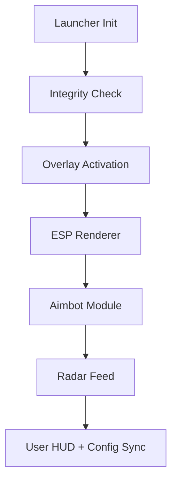

# DayZ Cheat Software – Advanced Survival & Combat Engine 🌍

When survival depends on milliseconds, **DayZ Cheat** gives you the tools to stay one step ahead. Designed for both PvP and PvE scenarios, it combines *stealthy ESP overlays*, *auto-aim precision*, and *real-time item tracking* into a single optimized engine.

Built for players who value awareness and control, this cheat ensures you never miss a threat, a shot, or a rare loot drop again.

---

## 🧭 Overview

**DayZ Cheat** delivers tactical visibility and precision that outperforms ordinary mods. Its external overlay ensures complete stealth operation, rendering ESP and aim systems independently of the DayZ client — no file edits, no bans, no lag.

With environmental awareness tools, enemy callouts, and configurable aimbot zones, you can dominate firefights *and* navigate hostile zones effortlessly.

> [!NOTE]
> All modules are optimized for the latest DayZ patch and are compatible with both community and official servers (non-VAC-protected environments).

---

## ⚙️ Core Features

### 👁 ESP (Enhanced Sensory Perception)

* Player outlines visible through walls
* Distance display and skeleton tracking
* Color-coded visibility indicators (green = hidden, red = exposed)
* Loot filter: weapons, food, meds, ammo, vehicles

### 🎯 Aimbot Precision System

* Adjustable aim speed (0.1–1.0 smooth range)
* Target prioritization (nearest / visible / armed)
* Smart bone targeting (head, torso, random for realism)
* Hotkey toggle (`F3`) with FOV customization

### 🧭 Loot & Radar Overlay

* 2D radar with directional enemy icons
* Item radar for supply drops and vehicles
* Configurable range up to 800 meters
* Works with in-game compass and coordinates

### 🧩 Config Control

* Save up to 5 profiles for quick switching
* Import/export `.json` or `.ini` configs
* Auto-load favorite setup on startup
* Supports multilingual HUD (EN, DE, RU)

---

## 🪟 Compatibility Table

| Platform                    | Supported | Notes                                |
| --------------------------- | --------- | ------------------------------------ |
| **Windows 10 / 11**         | ✅         | Admin privileges recommended         |
| **DayZ Standalone (Steam)** | ✅         | Fully tested on latest patch         |
| **Community Servers**       | ✅         | All BattleEye-disabled servers       |
| **Official Servers**        | ⚠️        | Use external overlay only            |
| **Controller Mode**         | ⚙️        | Partial – mapped via aim assist mode |

> [!WARNING]
> Never inject directly into the game memory when using BattleEye-enabled servers. Use overlay mode for safe operation.

---

## ⚡ Quick Setup

1. **Extract** `DayZ-Cheat.zip` to a secure directory.
2. **Run** `dayz_loader.exe` as Administrator.
3. Choose your **profile** (`Survivor`, `Hunter`, `Sniper`).
4. **Start DayZ** and wait for “Overlay Active” confirmation.
5. Use `Insert` to toggle ESP, and `F3` to enable Aim Mode.

Example command for a balanced configuration:

```bash
dayz.exe --aimbot=on --esp=full --fov=95 --smooth=0.45
```

Save your configuration with:

```bash
dayz.exe --save-config="night_ops.json"
```

---

## 🧩 Internal Workflow



---

## 🧠 Advanced Settings

Fine-tune your survival instincts using the built-in control file:

| Setting           | Function                  | Range    | Default |
| ----------------- | ------------------------- | -------- | ------- |
| `smooth`          | Aim transition speed      | 0.1–1.0  | 0.4     |
| `fov`             | Field of view for locking | 30–180   | 100     |
| `radar_range`     | Detection radius (m)      | 100–1000 | 600     |
| `loot_filter`     | Item tier visibility      | 1–5      | 3       |
| `highlight_color` | ESP RGB value             | HEX      | #00FF00 |

---

## ❓ FAQ

**Q1: Is DayZ Cheat undetectable?**
Yes — when using overlay mode. It operates externally and never modifies memory directly.

**Q2: Can it be used on modded servers?**
Absolutely. It supports both community and modded maps without config changes.

**Q3: Will my FPS drop?**
Minimal impact (<2% average). Optimized rendering ensures stability even on mid-range GPUs.

**Q4: How do I switch configs fast?**
Use hotkey profiles: `Ctrl + 1` to `Ctrl + 5` to swap between saved presets.

**Q5: Are updates automatic?**
Yes. The launcher checks for new offsets and patches on startup.

---

## 🧭 Sample Config Presets

**Stealth Survival**

```json
{
  "aimbot": "off",
  "esp": "players_only",
  "fov": 85,
  "smooth": 0.7,
  "loot_filter": 2
}
```

**Aggressive PvP**

```json
{
  "aimbot": "on",
  "target": "head",
  "fov": 120,
  "smooth": 0.3,
  "radar_range": 800
}
```

---

## 🚀 Final Thoughts

The **DayZ Cheat Software** is your survival enhancer, not just a tool. It turns every encounter into an advantage — whether spotting enemies through fog, tracking loot spawns, or landing that clutch shot from 400 meters away.

In a world where hesitation means death, **awareness is power**. Equip it. Master it. Survive longer.

---
